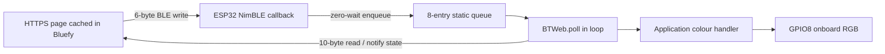

# Library architecture

`lib/BTWeb/src/BTWeb.h` is the public entry point. Implementation lives in `BTWeb.cpp` so projects do not repeatedly compile a large header or expose application pin configuration inside the library. `BTWebProtocol.h` has a standalone parser without Arduino dependencies.

## Public API and ownership

| API | Contract |
| --- | --- |
| `begin(name, handler, context)` | Call once in setup. Name must contain 1–20 bytes. Returns whether advertising started. On failure reset to retry. Null handler permits status-only use. |
| `poll()` | Call frequently from the Arduino loop task. Processes at most one queued event and one state publication per call. |
| `connected()` | Atomic link-status snapshot; safe to read from another task. |
| `setColor(colour)` | Loop-task-only update of reported logical output after an application-driven change; does not invoke the handler. |
| `color()` | Loop-task-only snapshot of the last application-accepted logical colour. |
| `ColorHandler` | Invoked from `poll`, never from NimBLE's callback. Return false to reject an unavailable output. Keep execution bounded. |

BTWeb owns the process-wide NimBLE instance. Use one static/global BTWeb object for the firmware lifetime. Copying is disabled. Destruction while BLE is running, runtime reinitialisation, multiple BTWeb objects, and another library controlling NimBLE are unsupported in this version. The caller owns the callback context and must keep it alive. Only `connected()` is exposed as a cross-task public operation; enqueue work from other tasks before calling the remaining API.

## Timing and queues

Callbacks validate bounded packets, copy one small event to a fixed FreeRTOS queue using zero timeout, or increment an atomic overflow counter. They do not drive LEDs, write logs, wait for clients or call user code. The BLE stack itself allocates memory and schedules radio activity; BTWeb does not claim a completely allocation-free or hard-real-time implementation.

The main loop processes at most one event per call. State notifications are coalesced to at most one every 30 ms. The app allows one outstanding command, so its normal operation receives one matching acknowledgement. Third-party clients that pipeline commands may see only the latest processed state; reads recover the latest state, not a history of acknowledgements. Queue overflow drops the newest event and reports a counter / Busy result. Notification failure leaves state dirty for the next rate-limited attempt.

Connection generation numbers discard queued events from an old session. A command already handed to the application when disconnection happens can still finish; disconnect is not an emergency-stop guarantee. The example intentionally replaces the last requested colour with an advertising blink after disconnect.

`millis()` subtraction handles wraparound. There are no delay-based blink loops or HTTP handlers. The example queues the latest desired LED colour. Its RMT driver checks completion with zero timeout, then sends 25 persistent symbols with wait-for-completion disabled: 24 data bits plus a hardware-generated 300 us latch. It never modifies symbols while a transfer is busy. RMT channel 0 has one owner, eliminating contention with another transmitter. Intermediate pending colours can be coalesced; acknowledgements mean application acceptance, not optically measured output. Driver setup and BLE stack internals are not hard-real-time operations. A runtime RMT error disables further LED submissions until reset. `yield()` gives the scheduler an opportunity to run other tasks.

## Browser execution

Web Bluetooth operations are asynchronous. Notifications carry confirmed board state. The controller awaits both the GATT write and matching application sequence acknowledgement. A four-second timeout or failure disconnects rather than silently retrying a possibly applied command. Reconnecting performs read/subscribe and a status request to establish current state. The sequence number wraps modulo 256 and is for acknowledgement correlation, not replay protection.

The service worker caches only repository assets, separately scoped by Pages path, and serves cached assets without waiting for network requests. New worker versions wait for existing pages to close before activation, avoiding a forced mid-session protocol update. Bump its cache version on controller changes; reopen online and repeat the offline test before field use.
